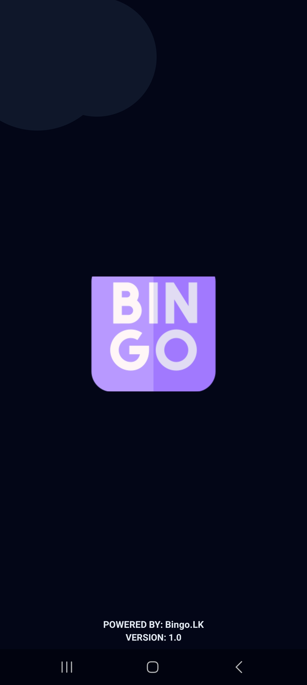
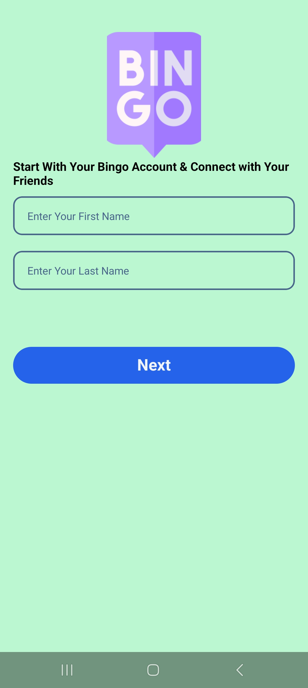
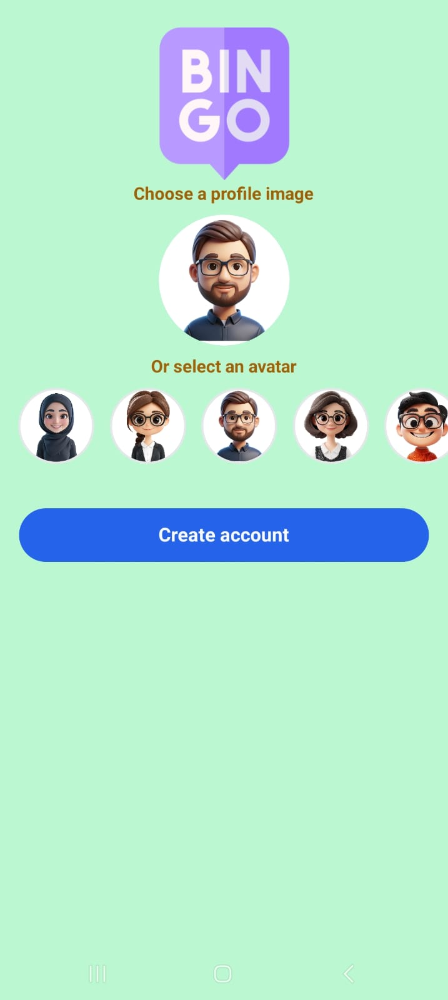
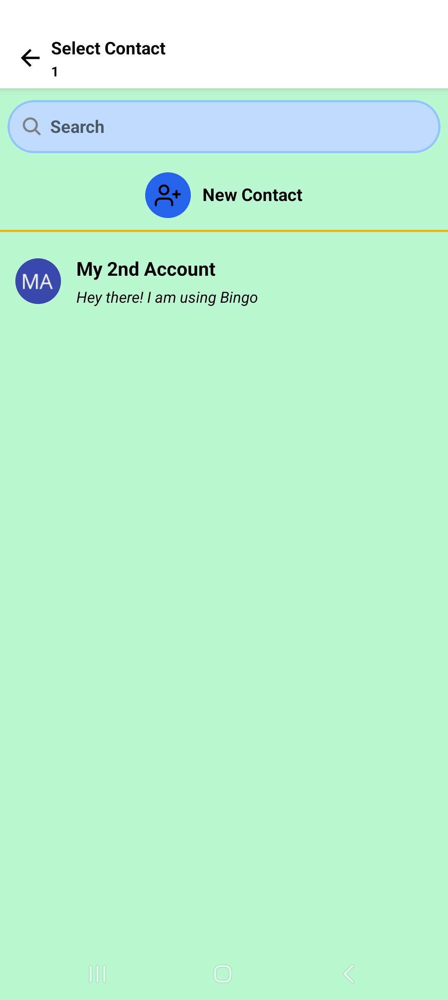
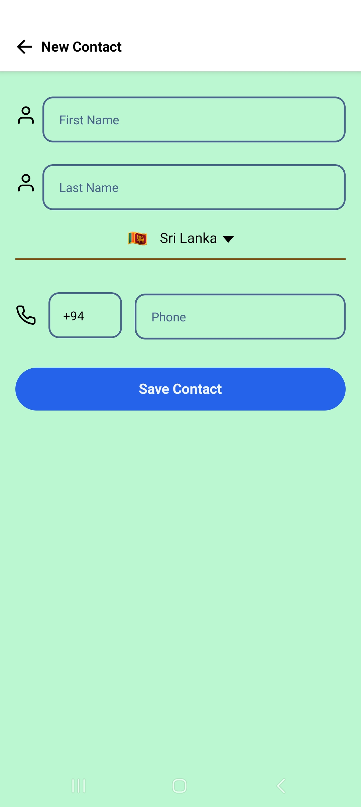
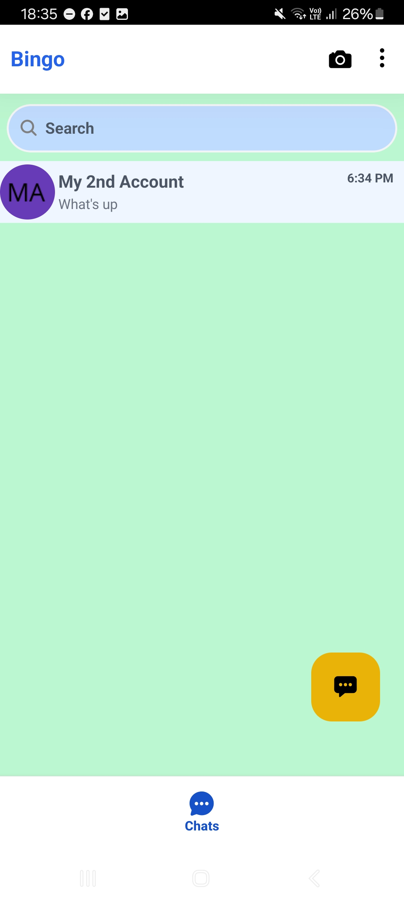
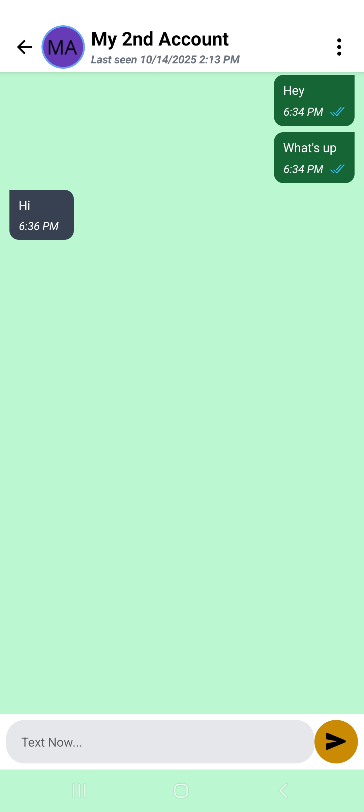

# Bingo

A modern, simple real-time chat application built with React Native, featuring user authentication, contact management, and seamless messaging.

## ✨ Features

- **User Authentication**: Secure sign-up and sign-in functionality
- **Real-time Messaging**: Instant chat with WebSocket integration
- **Contact Management**: Add and manage contacts for easy communication
- **Profile Management**: Customize user profiles and avatars
- **Theme Support**: Dark/light theme switching
- **Cross-platform**: Works on iOS and Android

## 🛠 Tech Stack

- **Frontend**: React Native, TypeScript
- **Styling**: NativeWind (Tailwind CSS for React Native)
- **State Management**: React Context API
- **Networking**: WebSocket for real-time communication
- **Backend**: (Add your backend details here, e.g., Node.js, Express, Socket.io)

## Prerequisites

- Node.js (v16 or higher)
- npm or yarn
- React Native CLI or Expo CLI
- iOS Simulator (for iOS development) or Android Studio (for Android development)

## 📦 Installation

1. Clone the repository:
   ```bash
   git clone https://github.com/your-username/chatapp.git
   cd chatapp
   ```

2. Install dependencies:
   ```bash
   npm install
   # or
   yarn install
   ```

3. For iOS (macOS only):
   ```bash
   cd ios && pod install && cd ..
   ```

4. Start the Metro bundler:
   ```bash
   npm start
   # or
   yarn start
   ```

5. Run on device/simulator:
   - For iOS: `npm run ios`
   - For Android: `npm run android`

## 💡 Usage

1. Launch the app on your device or simulator.
2. Sign up or sign in with your credentials.
3. Add contacts to start chatting.
4. Enjoy real-time messaging!

---

## 📁 Project Structure

```
src/
├── api/          # API services (e.g., UserService)
├── components/   # Reusable components (e.g., AuthProvider, UserContext)
├── screens/      # App screens (e.g., HomeScreen, ChatScreen)
├── socket/       # WebSocket hooks and providers
├── theme/        # Theme management
└── util/         # Utilities (e.g., date formatting, validation)
```

## 🤝 Contributing

Contributions are welcome! Please follow these steps:

1. Fork the repository.
2. Create a feature branch: `git checkout -b feature/your-feature-name`
3. Commit your changes: `git commit -m 'Add some feature'`
4. Push to the branch: `git push origin feature/your-feature-name`
5. Open a pull request.

---

## 📂 Screenshots









---

## 📄 License

This project is licensed under the MIT License - Feel free to use it as u wish

---

Built with ❤️ using React Native.
